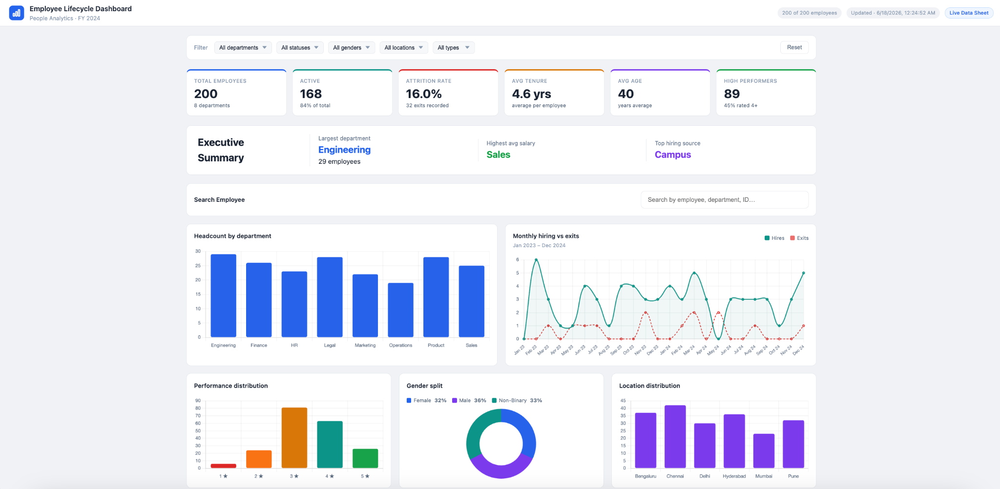
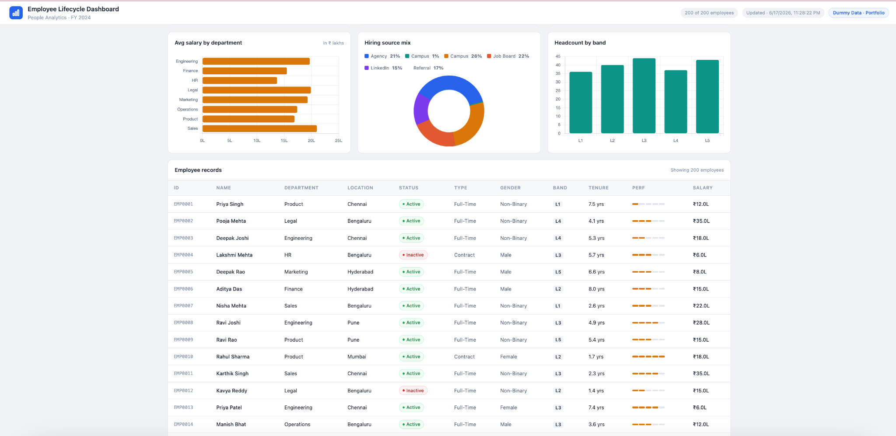

# 📊 Employee Lifecycle Dashboard

### People Analytics • Workforce Intelligence • FY 2024

Interactive HR Analytics Dashboard built using HTML, CSS, JavaScript and spreadsheet-driven data.

This project visualizes employee lifecycle insights through executive KPIs, workforce analytics, employee search, compensation trends, and interactive reporting.

---

# 📸 Dashboard Preview

## Executive Dashboard



---

## Workforce Analytics & Employee Records



---

# ✨ Features

### Executive Analytics

* Total Employees
* Active Workforce
* Attrition Rate
* Average Tenure
* Average Age
* High Performer Tracking

### Employee Insights

* Department Headcount
* Employee Search
* Gender Split
* Location Distribution
* Workforce Band Analysis

### Workforce Lifecycle

* Hiring Trends
* Exit Tracking
* Compensation Analytics
* Hiring Source Analysis

### Interactive Experience

* Dynamic Filters
* Search Capability
* Cross Filtering
* Real-time Dashboard Interaction

---

# 🛠️ Tech Stack

| Category        | Technology              |
| --------------- | ----------------------- |
| Frontend        | HTML • CSS • JavaScript |
| Data Source     | Google Sheets           |
| Version Control | GitHub                  |
| AI Development  | Claude • ChatGPT        |

---

# 📈 Business Use Cases

* Workforce Planning
* HR Reporting
* People Analytics
* Leadership Dashboards
* Employee Insights

---

# 📂 Repository Structure

```plaintext
employee-lifecycle-dashboard/
│
├── index.html
├── README.md
├── dashboard-overview.png
├── employee-records.png
├── assets/
```

---

# 🔮 Future Enhancements

* Advanced Employee Profiles
* Export Functionality
* Automated Refresh
* Mobile Optimization

---

# ⚠️ Disclaimer

This project uses dummy employee data and was created for portfolio and demonstration purposes.

No real employee information has been used.

---

# 👤 Author

**Sanskrit Ramanathan**
People Operations • HR Analytics • Process Automation
